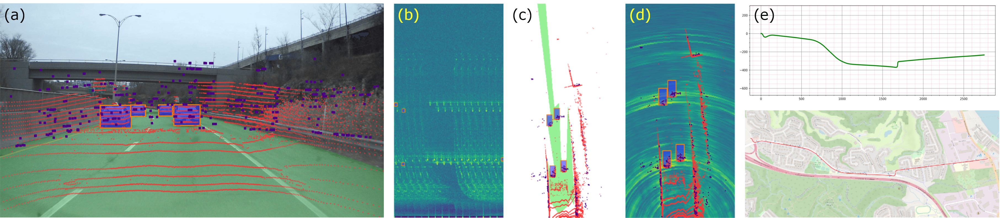
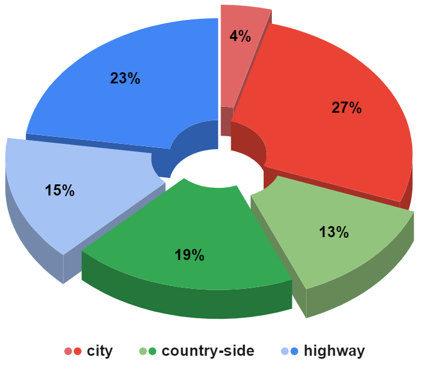
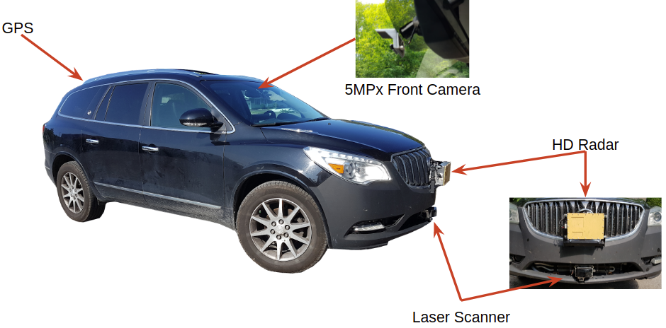
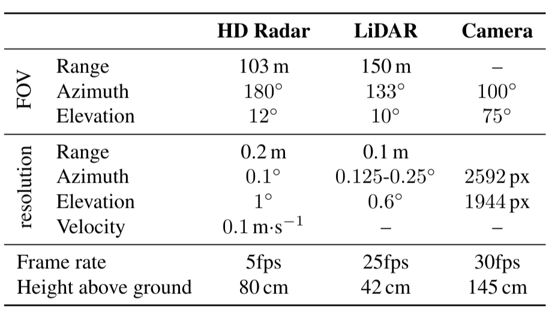

# RADIal dataset
RADIal stands for “Radar,  Lidar et  al.” It's a collection of 2-hour of raw  data  from  synchronized  automotive-grade  sensors (camera,  laser,  High Definition  radar)  in  various  environments  (citystreet,  highway,  countryside  road) and comes with GPS and vehicle’s CAN traces.

mettre un gif

RADIal contains 91 sequences of 1 to 4 minutes in duration, for a total of 2 hours. These sequences are categorized in highway, country-side and city driving. The distribution of the sequences is indicated in the figure below. Each  sequence  contains raw  sensor signals recorded  with their native frame rate. There are approximately 25,000 frames with the three sensors synchronized, out of which 8,252 are labelled with a total of 9,550 vehicles.

# Sensor  specifications

Central  to  the RADIal  dataset,   our  high-definition  radar  is  composed  of NRx=16 receiving antennas and NTx= 12 transmitting antennas, leading to NRx·NTx= 192 virtual antennas. This virtual-antenna array enables reaching a high azimuth angular resolution while estimating objects’ elevation angles as well. As the radar signal is difficult to interpret by annotators and practitioners alike, a 16-layer automotive-grade laser scanner (LiDAR) and a 5 Mpix RGB camera are also provided. The  camera  is  placed  below  the  interior  mirror behind the windshield while the radar and the LiDAR are installed in the middle of the front ventilation grid, one above the other. The three sensors have parallel horizontallines of sight, pointing in the driving direction. Their extrinsic parameters are provided together with the dataset.  RADIal also offers synchronized GPS and CAN traces which give access to the geo-referenced position of the vehicle as well as its driving information such as speed, steering wheelangle and yaw rate. The sensors’ specifications are detailed in the table below.

# Labels
Out of the 25,000 synchronized frames, 8,252 frames are labelled.
Labels for vehicles are provided as 4D points coordinates (x,y,z,v).
Labels for the Free-driving-space is provided as a segmnettaion mask.

# Get the data
$ wget https://www.dropbox.com/s/ubbwvdyskrkv7dn/RADIal_extract.zip?dl=0

# Citation

